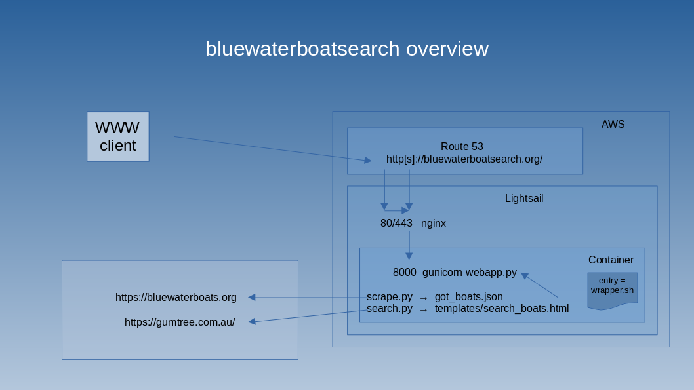

# bluewaterboatsearch(.org)

This repo implements two scrapers, with the data output through gunicorn. Github actions push it to
[Docker Hub](https://hub.docker.com/gary5691/bluewaterboatsearch) as a container. 

It's running at [bluewaterboatsearch.org](https://bluewaterboatsearch.org)

